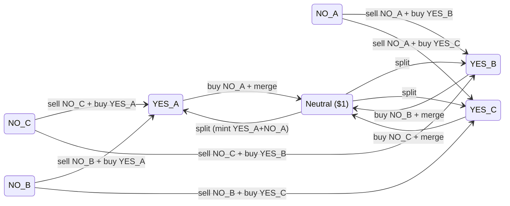
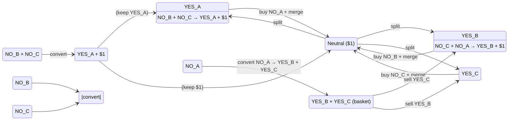
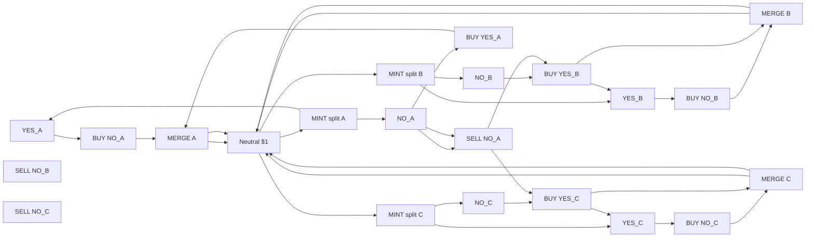
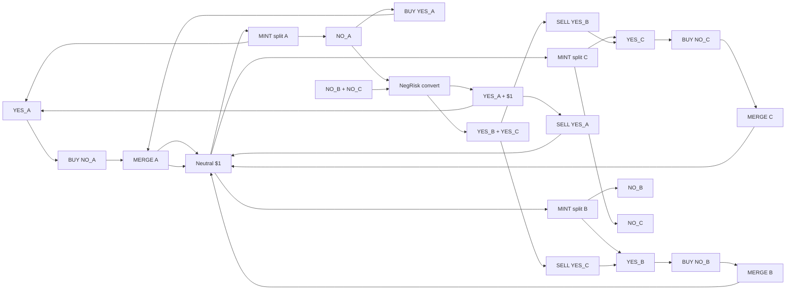
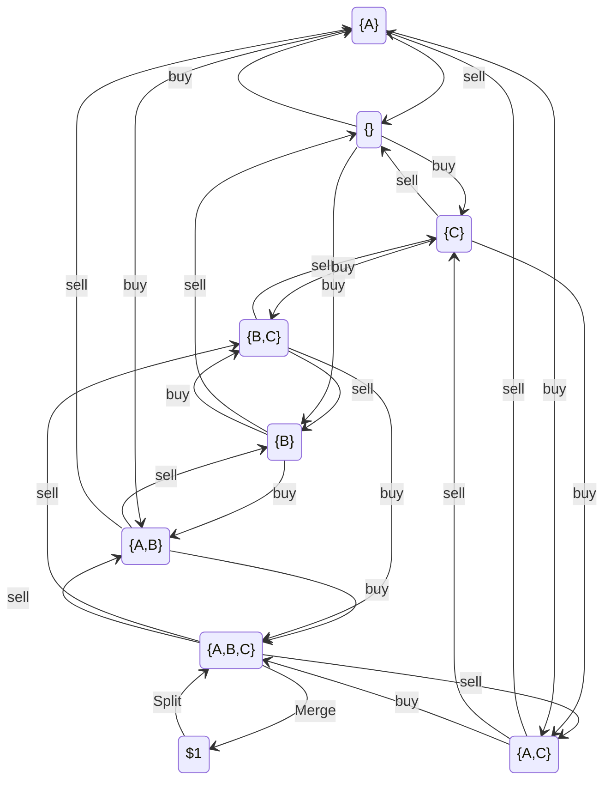

```mermaid
stateDiagram-v2
    %% Plain YNB (no NegRisk)
    direction LR

    state "YES_A" as YA
    state "YES_B" as YB
    state "YES_C" as YC
    state "NO_A"  as NA
    state "NO_B"  as NB
    state "NO_C"  as NC
    state "Neutral ($1)" as CASH

    %% Merge / Split (pairwise with same bundle)
    YA --> CASH: buy NO_A + merge
    CASH --> YA: split (mint YES_A+NO_A)

    YB --> CASH: buy NO_B + merge
    CASH --> YB: split

    YC --> CASH: buy NO_C + merge
    CASH --> YC: split

    %% Rebalancing without NegRisk: must leg via sells/buys
    NA --> YB: sell NO_A + buy YES_B
    NA --> YC: sell NO_A + buy YES_C

    NB --> YA: sell NO_B + buy YES_A
    NB --> YC: sell NO_B + buy YES_C

    NC --> YA: sell NO_C + buy YES_A
    NC --> YB: sell NO_C + buy YES_B
```

```mermaid
stateDiagram-v2
    %% YNB with NegRisk converts
    direction LR

    state "YES_A" as YA
    state "YES_B" as YB
    state "YES_C" as YC
    state "NO_A"  as NA
    state "NO_B"  as NB
    state "NO_C"  as NC
    state "Neutral ($1)" as CASH

    %% Optional composite 'basket' helpers for visualization
    state "YES_B + YES_C (basket)" as YBC
    state "NO_B + NO_C" as NBC
    state "YES_A + $1"  as YA1

    %% Merge / Split (unchanged)
    YA --> CASH: buy NO_A + merge
    CASH --> YA: split
    YB --> CASH: buy NO_B + merge
    CASH --> YB: split
    YC --> CASH: buy NO_C + merge
    CASH --> YC: split

    %% NegRisk converts (atomic, payoff-preserving)
    NA --> YBC: convert NO_A → YES_B + YES_C
    NB --> |convert| YA: NO_B + NO_C → YES_A + $1
    NC --> |convert| YB: NO_C + NO_A → YES_B + $1
    %% (symmetry omitted for brevity)

    %% From baskets to targeted legs (one sale)
    YBC --> YB: sell YES_C
    YBC --> YC: sell YES_B

    %% Cash leg from double-NO convert
    NBC --> YA1: convert
    YA1 --> YA: (keep YES_A)
    YA1 --> CASH: (keep $1)
```

```mermaid
flowchart LR
  YA[YES_A]
  YB[YES_B]
  YC[YES_C]
  NA[NO_A]
  NB[NO_B]
  NC[NO_C]
  CASH[Neutral $1]

  MINT_A[MINT split A]
  MERGE_A[MERGE A]
  MINT_B[MINT split B]
  MERGE_B[MERGE B]
  MINT_C[MINT split C]
  MERGE_C[MERGE C]

  BUY_NO_A[BUY NO_A]
  BUY_NO_B[BUY NO_B]
  BUY_NO_C[BUY NO_C]

  BUY_YA[BUY YES_A]
  BUY_YB[BUY YES_B]
  BUY_YC[BUY YES_C]

  SELL_NO_A[SELL NO_A]
  SELL_NO_B[SELL NO_B]
  SELL_NO_C[SELL NO_C]

  %% Neutral <-> YES/NO within same bundle
  CASH --> MINT_A --> YA
  MINT_A --> NA
  YA --> BUY_NO_A --> MERGE_A --> CASH
  NA --> BUY_YA   --> MERGE_A --> CASH

  CASH --> MINT_B --> YB
  MINT_B --> NB
  YB --> BUY_NO_B --> MERGE_B --> CASH
  NB --> BUY_YB   --> MERGE_B --> CASH

  CASH --> MINT_C --> YC
  MINT_C --> NC
  YC --> BUY_NO_C --> MERGE_C --> CASH
  NC --> BUY_YC   --> MERGE_C --> CASH

  %% Cross-outcome rebalancing (must leg via sell + buy)
  NA --> SELL_NO_A --> BUY_YB --> YB
  NA --> SELL_NO_A --> BUY_YC --> YC
```

```mermaid
flowchart LR
  YA[YES_A]
  YB[YES_B]
  YC[YES_C]
  NA[NO_A]
  NB[NO_B]
  NC[NO_C]
  CASH[Neutral $1]

  MINT_A[MINT split A]
  MERGE_A[MERGE A]
  MINT_B[MINT split B]
  MERGE_B[MERGE B]
  MINT_C[MINT split C]
  MERGE_C[MERGE C]

  BUY_NO_A[BUY NO_A]
  BUY_NO_B[BUY NO_B]
  BUY_NO_C[BUY NO_C]

  BUY_YA[BUY YES_A]
  SELL_YA[SELL YES_A]
  SELL_YB[SELL YES_B]
  SELL_YC[SELL YES_C]

  NR[NegRisk convert]
  YBC[YES_B + YES_C]
  NBC[NO_B + NO_C]
  YA1[YES_A + $1]

  %% Neutral <-> YES/NO within same bundle (still available)
  CASH --> MINT_A --> YA
  MINT_A --> NA
  YA --> BUY_NO_A --> MERGE_A --> CASH
  NA --> BUY_YA   --> MERGE_A --> CASH

  CASH --> MINT_B --> YB
  MINT_B --> NB
  YB --> BUY_NO_B --> MERGE_B --> CASH
  CASH --> MINT_C --> YC
  MINT_C --> NC
  YC --> BUY_NO_C --> MERGE_C --> CASH

  %% NegRisk converts
  NA --> NR --> YBC
  YBC --> SELL_YB --> YC
  YBC --> SELL_YC --> YB

  NBC --> NR --> YA1
  YA1 --> SELL_YA --> CASH
  YA1 --> YA
```

```mermaid
stateDiagram-v2
  State "{}" as 000
  State "{C}" as 001
  State "{B}" as 010
  State "{B,C}" as 011
  State "{A}" as 100
  State "{A,C}" as 101
  State "{A,B}" as 110
  State "{A,B,C}" as 111
  State "$1" as Unit
  
  Unit --> 111: Split
  
  111 --> Unit: Merge
  
  111 --> 011: sell
  111 --> 101: sell
  111 --> 110: sell
  
  101 --> 100: sell
  101 --> 001: sell
  101 --> 111: buy
  
  110 --> 010: sell
  110 --> 100: sell
  110 --> 111: buy
  
  011 --> 010: sell
  011 --> 001: sell
  011 --> 111: buy

  001 --> 000: sell
  001 --> 011: buy
  001 --> 101: buy
  
  010 --> 000: sell
  010 --> 011: buy
  010 --> 110: buy
  
  100 --> 000: sell
  100 --> 110: buy
  100 --> 101: buy
  
  000 --> 001: buy
  000 --> 010: buy
  000 --> 100: buy
  

  

  


  
 
  
```

```mermaid
stateDiagram-v2
  State "$1" as Unit
  State "{}" as 000000
  State "{CN}" as 000001
  State "{CY}" as 000010
  State "{}+$1" as 000011
  State "{BN}" as 000100
  State "{BN,CN}" as 000101
  State "{BN,CY}" as 000110
  State "{BN}+$1" as 000111
  State "{BY}" as 001000
  State "{BY,CN}" as 001001
  State "{BY,CY}" as 001010
  State "{BY}+$1" as 001011
  State "{}+$1" as 001100
  State "{CN}+$1" as 001101
  State "{CY}+$1" as 001110
  State "{}+$2" as 001111
  State "{AN}" as 010000
  State "{AN,CN}" as 010001
  State "{AN,CY}" as 010010
  State "{AN}+$1" as 010011
  State "{AN,BN}" as 010100
  State "{AN,BN,CN}" as 010101
  State "{AN,BN,CY}" as 010110
  State "{AN,BN}+$1" as 010111
  State "{AN,BY}" as 011000
  State "{AN,BY,CN}" as 011001
  State "{AN,BY,CY}" as 011010
  State "{AN,BY}+$1" as 011011
  State "{AN}+$1" as 011100
  State "{AN,CN}+$1" as 011101
  State "{AN,CY}+$1" as 011110
  State "{AN}+$2" as 011111
  State "{AY}" as 100000
  State "{AY,CN}" as 100001
  State "{AY,CY}" as 100010
  State "{AY}+$1" as 100011
  State "{AY,BN}" as 100100
  State "{AY,BN,CN}" as 100101
  State "{AY,BN,CY}" as 100110
  State "{AY,BN}+$1" as 100111
  State "{AY,BY}" as 101000
  State "{AY,BY,CN}" as 101001
  State "{AY,BY,CY}" as 101010
  State "{AY,BY}+$1" as 101011
  State "{AY}+$1" as 101100
  State "{AY,CN}+$1" as 101101
  State "{AY,CY}+$1" as 101110
  State "{AY}+$2" as 101111
  State "{}+$1" as 110000
  State "{CN}+$1" as 110001
  State "{CY}+$1" as 110010
  State "{}+$2" as 110011
  State "{BN}+$1" as 110100
  State "{BN,CN}+$1" as 110101
  State "{BN,CY}+$1" as 110110
  State "{BN}+$2" as 110111
  State "{BY}+$1" as 111000
  State "{BY,CN}+$1" as 111001
  State "{BY,CY}+$1" as 111010
  State "{BY}+$2" as 111011
  State "{}+$2" as 111100
  State "{CN}+$2" as 111101
  State "{CY}+$2" as 111110
  State "{}+$3" as 111111
  
000000 --> 100000: buy
000000 --> 010000: buy
000000 --> 001000: buy
000000 --> 000100: buy
000000 --> 000010: buy
000000 --> 000001: buy
000001 --> 100001: buy
000001 --> 010001: buy
000001 --> 001001: buy
000001 --> 000101: buy
000001 --> 000011: buy
000001 --> 000000: sell
000010 --> 100010: buy
000010 --> 010010: buy
000010 --> 001010: buy
000010 --> 000110: buy
000010 --> 000000: sell
000010 --> 000011: buy
000011 --> 100011: buy
000011 --> 010011: buy
000011 --> 001011: buy
000011 --> 000111: buy
000011 --> 000001: sell
000011 --> 000010: sell
000100 --> 100100: buy
000100 --> 010100: buy
000100 --> 001100: buy
000100 --> 000000: sell
000100 --> 000110: buy
000100 --> 000101: buy
000101 --> 100101: buy
000101 --> 010101: buy
000101 --> 001101: buy
000101 --> 000001: sell
000101 --> 000111: buy
000101 --> 000100: sell
000110 --> 100110: buy
000110 --> 010110: buy
000110 --> 001110: buy
000110 --> 000010: sell
000110 --> 000100: sell
000110 --> 000111: buy
000111 --> 100111: buy
000111 --> 010111: buy
000111 --> 001111: buy
000111 --> 000011: sell
000111 --> 000101: sell
000111 --> 000110: sell
001000 --> 101000: buy
001000 --> 011000: buy
001000 --> 000000: sell
001000 --> 001100: buy
001000 --> 001010: buy
001000 --> 001001: buy
001001 --> 101001: buy
001001 --> 011001: buy
001001 --> 000001: sell
001001 --> 001101: buy
001001 --> 001011: buy
001001 --> 001000: sell
001010 --> 101010: buy
001010 --> 011010: buy
001010 --> 000010: sell
001010 --> 001110: buy
001010 --> 001000: sell
001010 --> 001011: buy
001011 --> 101011: buy
001011 --> 011011: buy
001011 --> 000011: sell
001011 --> 001111: buy
001011 --> 001001: sell
001011 --> 001010: sell
001100 --> 101100: buy
001100 --> 011100: buy
001100 --> 000100: sell
001100 --> 001000: sell
001100 --> 001110: buy
001100 --> 001101: buy
001101 --> 101101: buy
001101 --> 011101: buy
001101 --> 000101: sell
001101 --> 001001: sell
001101 --> 001111: buy
001101 --> 001100: sell
001110 --> 101110: buy
001110 --> 011110: buy
001110 --> 000110: sell
001110 --> 001010: sell
001110 --> 001100: sell
001110 --> 001111: buy
001111 --> 101111: buy
001111 --> 011111: buy
001111 --> 000111: sell
001111 --> 001011: sell
001111 --> 001101: sell
001111 --> 001110: sell
010000 --> 110000: buy
010000 --> 000000: sell
010000 --> 011000: buy
010000 --> 010100: buy
010000 --> 010010: buy
010000 --> 010001: buy
010001 --> 110001: buy
010001 --> 000001: sell
010001 --> 011001: buy
010001 --> 010101: buy
010001 --> 010011: buy
010001 --> 010000: sell
010010 --> 110010: buy
010010 --> 000010: sell
010010 --> 011010: buy
010010 --> 010110: buy
010010 --> 010000: sell
010010 --> 010011: buy
010011 --> 110011: buy
010011 --> 000011: sell
010011 --> 011011: buy
010011 --> 010111: buy
010011 --> 010001: sell
010011 --> 010010: sell
010100 --> 110100: buy
010100 --> 000100: sell
010100 --> 011100: buy
010100 --> 010000: sell
010100 --> 010110: buy
010100 --> 010101: buy
010101 --> 110101: buy
010101 --> 000101: sell
010101 --> 011101: buy
010101 --> 010001: sell
010101 --> 010111: buy
010101 --> 010100: sell
010110 --> 110110: buy
010110 --> 000110: sell
010110 --> 011110: buy
010110 --> 010010: sell
010110 --> 010100: sell
010110 --> 010111: buy
010111 --> 110111: buy
010111 --> 000111: sell
010111 --> 011111: buy
010111 --> 010011: sell
010111 --> 010101: sell
010111 --> 010110: sell
011000 --> 111000: buy
011000 --> 001000: sell
011000 --> 010000: sell
011000 --> 011100: buy
011000 --> 011010: buy
011000 --> 011001: buy
011001 --> 111001: buy
011001 --> 001001: sell
011001 --> 010001: sell
011001 --> 011101: buy
011001 --> 011011: buy
011001 --> 011000: sell
011010 --> 111010: buy
011010 --> 001010: sell
011010 --> 010010: sell
011010 --> 011110: buy
011010 --> 011000: sell
011010 --> 011011: buy
011011 --> 111011: buy
011011 --> 001011: sell
011011 --> 010011: sell
011011 --> 011111: buy
011011 --> 011001: sell
011011 --> 011010: sell
011100 --> 111100: buy
011100 --> 001100: sell
011100 --> 010100: sell
011100 --> 011000: sell
011100 --> 011110: buy
011100 --> 011101: buy
011101 --> 111101: buy
011101 --> 001101: sell
011101 --> 010101: sell
011101 --> 011001: sell
011101 --> 011111: buy
011101 --> 011100: sell
011110 --> 111110: buy
011110 --> 001110: sell
011110 --> 010110: sell
011110 --> 011010: sell
011110 --> 011100: sell
011110 --> 011111: buy
011111 --> 111111: buy
011111 --> 001111: sell
011111 --> 010111: sell
011111 --> 011011: sell
011111 --> 011101: sell
011111 --> 011110: sell
100000 --> 000000: sell
100000 --> 110000: buy
100000 --> 101000: buy
100000 --> 100100: buy
100000 --> 100010: buy
100000 --> 100001: buy
100001 --> 000001: sell
100001 --> 110001: buy
100001 --> 101001: buy
100001 --> 100101: buy
100001 --> 100011: buy
100001 --> 100000: sell
100010 --> 000010: sell
100010 --> 110010: buy
100010 --> 101010: buy
100010 --> 100110: buy
100010 --> 100000: sell
100010 --> 100011: buy
100011 --> 000011: sell
100011 --> 110011: buy
100011 --> 101011: buy
100011 --> 100111: buy
100011 --> 100001: sell
100011 --> 100010: sell
100100 --> 000100: sell
100100 --> 110100: buy
100100 --> 101100: buy
100100 --> 100000: sell
100100 --> 100110: buy
100100 --> 100101: buy
100101 --> 000101: sell
100101 --> 110101: buy
100101 --> 101101: buy
100101 --> 100001: sell
100101 --> 100111: buy
100101 --> 100100: sell
100110 --> 000110: sell
100110 --> 110110: buy
100110 --> 101110: buy
100110 --> 100010: sell
100110 --> 100100: sell
100110 --> 100111: buy
100111 --> 000111: sell
100111 --> 110111: buy
100111 --> 101111: buy
100111 --> 100011: sell
100111 --> 100101: sell
100111 --> 100110: sell
101000 --> 001000: sell
101000 --> 111000: buy
101000 --> 100000: sell
101000 --> 101100: buy
101000 --> 101010: buy
101000 --> 101001: buy
101001 --> 001001: sell
101001 --> 111001: buy
101001 --> 100001: sell
101001 --> 101101: buy
101001 --> 101011: buy
101001 --> 101000: sell
101010 --> 001010: sell
101010 --> 111010: buy
101010 --> 100010: sell
101010 --> 101110: buy
101010 --> 101000: sell
101010 --> 101011: buy
101011 --> 001011: sell
101011 --> 111011: buy
101011 --> 100011: sell
101011 --> 101111: buy
101011 --> 101001: sell
101011 --> 101010: sell
101100 --> 001100: sell
101100 --> 111100: buy
101100 --> 100100: sell
101100 --> 101000: sell
101100 --> 101110: buy
101100 --> 101101: buy
101101 --> 001101: sell
101101 --> 111101: buy
101101 --> 100101: sell
101101 --> 101001: sell
101101 --> 101111: buy
101101 --> 101100: sell
101110 --> 001110: sell
101110 --> 111110: buy
101110 --> 100110: sell
101110 --> 101010: sell
101110 --> 101100: sell
101110 --> 101111: buy
101111 --> 001111: sell
101111 --> 111111: buy
101111 --> 100111: sell
101111 --> 101011: sell
101111 --> 101101: sell
101111 --> 101110: sell
110000 --> 010000: sell
110000 --> 100000: sell
110000 --> 111000: buy
110000 --> 110100: buy
110000 --> 110010: buy
110000 --> 110001: buy
110001 --> 010001: sell
110001 --> 100001: sell
110001 --> 111001: buy
110001 --> 110101: buy
110001 --> 110011: buy
110001 --> 110000: sell
110010 --> 010010: sell
110010 --> 100010: sell
110010 --> 111010: buy
110010 --> 110110: buy
110010 --> 110000: sell
110010 --> 110011: buy
110011 --> 010011: sell
110011 --> 100011: sell
110011 --> 111011: buy
110011 --> 110111: buy
110011 --> 110001: sell
110011 --> 110010: sell
110100 --> 010100: sell
110100 --> 100100: sell
110100 --> 111100: buy
110100 --> 110000: sell
110100 --> 110110: buy
110100 --> 110101: buy
110101 --> 010101: sell
110101 --> 100101: sell
110101 --> 111101: buy
110101 --> 110001: sell
110101 --> 110111: buy
110101 --> 110100: sell
110110 --> 010110: sell
110110 --> 100110: sell
110110 --> 111110: buy
110110 --> 110010: sell
110110 --> 110100: sell
110110 --> 110111: buy
110111 --> 010111: sell
110111 --> 100111: sell
110111 --> 111111: buy
110111 --> 110011: sell
110111 --> 110101: sell
110111 --> 110110: sell
111000 --> 011000: sell
111000 --> 101000: sell
111000 --> 110000: sell
111000 --> 111100: buy
111000 --> 111010: buy
111000 --> 111001: buy
111001 --> 011001: sell
111001 --> 101001: sell
111001 --> 110001: sell
111001 --> 111101: buy
111001 --> 111011: buy
111001 --> 111000: sell
111010 --> 011010: sell
111010 --> 101010: sell
111010 --> 110010: sell
111010 --> 111110: buy
111010 --> 111000: sell
111010 --> 111011: buy
111011 --> 011011: sell
111011 --> 101011: sell
111011 --> 110011: sell
111011 --> 111111: buy
111011 --> 111001: sell
111011 --> 111010: sell
111100 --> 011100: sell
111100 --> 101100: sell
111100 --> 110100: sell
111100 --> 111000: sell
111100 --> 111110: buy
111100 --> 111101: buy
111101 --> 011101: sell
111101 --> 101101: sell
111101 --> 110101: sell
111101 --> 111001: sell
111101 --> 111111: buy
111101 --> 111100: sell
111110 --> 011110: sell
111110 --> 101110: sell
111110 --> 110110: sell
111110 --> 111010: sell
111110 --> 111100: sell
111110 --> 111111: buy
111111 --> 011111: sell
111111 --> 101111: sell
111111 --> 110111: sell
111111 --> 111011: sell
111111 --> 111101: sell
111111 --> 111110: sell
  

```

