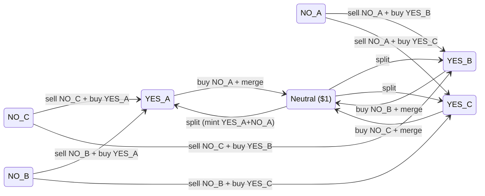
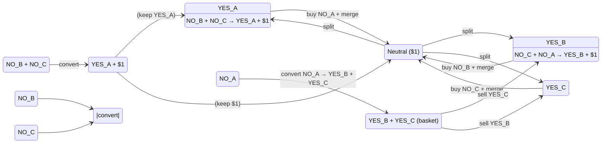
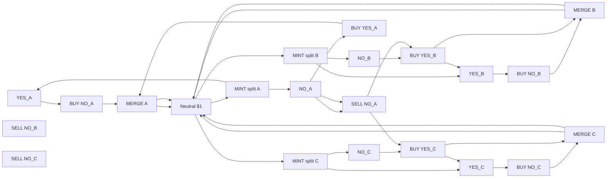
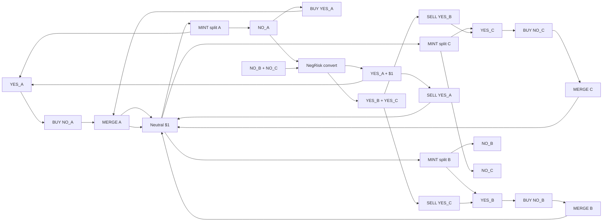
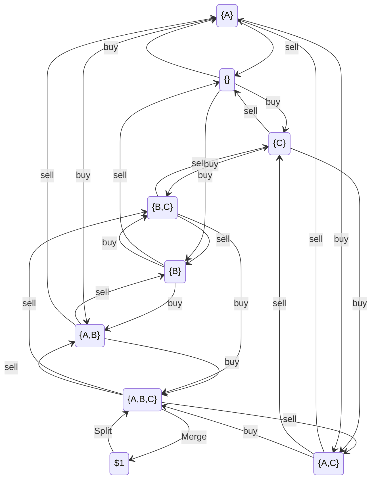

```mermaid
stateDiagram-v2
    %% Plain YNB (no NegRisk)
    direction LR

    state "YES_A" as YA
    state "YES_B" as YB
    state "YES_C" as YC
    state "NO_A"  as NA
    state "NO_B"  as NB
    state "NO_C"  as NC
    state "Neutral ($1)" as CASH

    %% Merge / Split (pairwise with same bundle)
    YA --> CASH: buy NO_A + merge
    CASH --> YA: split (mint YES_A+NO_A)

    YB --> CASH: buy NO_B + merge
    CASH --> YB: split

    YC --> CASH: buy NO_C + merge
    CASH --> YC: split

    %% Rebalancing without NegRisk: must leg via sells/buys
    NA --> YB: sell NO_A + buy YES_B
    NA --> YC: sell NO_A + buy YES_C

    NB --> YA: sell NO_B + buy YES_A
    NB --> YC: sell NO_B + buy YES_C

    NC --> YA: sell NO_C + buy YES_A
    NC --> YB: sell NO_C + buy YES_B
```

```mermaid
stateDiagram-v2
    %% YNB with NegRisk converts
    direction LR

    state "YES_A" as YA
    state "YES_B" as YB
    state "YES_C" as YC
    state "NO_A"  as NA
    state "NO_B"  as NB
    state "NO_C"  as NC
    state "Neutral ($1)" as CASH

    %% Optional composite 'basket' helpers for visualization
    state "YES_B + YES_C (basket)" as YBC
    state "NO_B + NO_C" as NBC
    state "YES_A + $1"  as YA1

    %% Merge / Split (unchanged)
    YA --> CASH: buy NO_A + merge
    CASH --> YA: split
    YB --> CASH: buy NO_B + merge
    CASH --> YB: split
    YC --> CASH: buy NO_C + merge
    CASH --> YC: split

    %% NegRisk converts (atomic, payoff-preserving)
    NA --> YBC: convert NO_A → YES_B + YES_C
    NB --> |convert| YA: NO_B + NO_C → YES_A + $1
    NC --> |convert| YB: NO_C + NO_A → YES_B + $1
    %% (symmetry omitted for brevity)

    %% From baskets to targeted legs (one sale)
    YBC --> YB: sell YES_C
    YBC --> YC: sell YES_B

    %% Cash leg from double-NO convert
    NBC --> YA1: convert
    YA1 --> YA: (keep YES_A)
    YA1 --> CASH: (keep $1)
```

```mermaid
flowchart LR
  YA[YES_A]
  YB[YES_B]
  YC[YES_C]
  NA[NO_A]
  NB[NO_B]
  NC[NO_C]
  CASH[Neutral $1]

  MINT_A[MINT split A]
  MERGE_A[MERGE A]
  MINT_B[MINT split B]
  MERGE_B[MERGE B]
  MINT_C[MINT split C]
  MERGE_C[MERGE C]

  BUY_NO_A[BUY NO_A]
  BUY_NO_B[BUY NO_B]
  BUY_NO_C[BUY NO_C]

  BUY_YA[BUY YES_A]
  BUY_YB[BUY YES_B]
  BUY_YC[BUY YES_C]

  SELL_NO_A[SELL NO_A]
  SELL_NO_B[SELL NO_B]
  SELL_NO_C[SELL NO_C]

  %% Neutral <-> YES/NO within same bundle
  CASH --> MINT_A --> YA
  MINT_A --> NA
  YA --> BUY_NO_A --> MERGE_A --> CASH
  NA --> BUY_YA   --> MERGE_A --> CASH

  CASH --> MINT_B --> YB
  MINT_B --> NB
  YB --> BUY_NO_B --> MERGE_B --> CASH
  NB --> BUY_YB   --> MERGE_B --> CASH

  CASH --> MINT_C --> YC
  MINT_C --> NC
  YC --> BUY_NO_C --> MERGE_C --> CASH
  NC --> BUY_YC   --> MERGE_C --> CASH

  %% Cross-outcome rebalancing (must leg via sell + buy)
  NA --> SELL_NO_A --> BUY_YB --> YB
  NA --> SELL_NO_A --> BUY_YC --> YC
```

```mermaid
flowchart LR
  YA[YES_A]
  YB[YES_B]
  YC[YES_C]
  NA[NO_A]
  NB[NO_B]
  NC[NO_C]
  CASH[Neutral $1]

  MINT_A[MINT split A]
  MERGE_A[MERGE A]
  MINT_B[MINT split B]
  MERGE_B[MERGE B]
  MINT_C[MINT split C]
  MERGE_C[MERGE C]

  BUY_NO_A[BUY NO_A]
  BUY_NO_B[BUY NO_B]
  BUY_NO_C[BUY NO_C]

  BUY_YA[BUY YES_A]
  SELL_YA[SELL YES_A]
  SELL_YB[SELL YES_B]
  SELL_YC[SELL YES_C]

  NR[NegRisk convert]
  YBC[YES_B + YES_C]
  NBC[NO_B + NO_C]
  YA1[YES_A + $1]

  %% Neutral <-> YES/NO within same bundle (still available)
  CASH --> MINT_A --> YA
  MINT_A --> NA
  YA --> BUY_NO_A --> MERGE_A --> CASH
  NA --> BUY_YA   --> MERGE_A --> CASH

  CASH --> MINT_B --> YB
  MINT_B --> NB
  YB --> BUY_NO_B --> MERGE_B --> CASH
  CASH --> MINT_C --> YC
  MINT_C --> NC
  YC --> BUY_NO_C --> MERGE_C --> CASH

  %% NegRisk converts
  NA --> NR --> YBC
  YBC --> SELL_YB --> YC
  YBC --> SELL_YC --> YB

  NBC --> NR --> YA1
  YA1 --> SELL_YA --> CASH
  YA1 --> YA
```

```mermaid
stateDiagram-v2
  State "{}" as 000
  State "{C}" as 001
  State "{B}" as 010
  State "{B,C}" as 011
  State "{A}" as 100
  State "{A,C}" as 101
  State "{A,B}" as 110
  State "{A,B,C}" as 111
  State "$1" as Unit
  
  Unit --> 111: Split
  
  111 --> Unit: Merge
  
  111 --> 011: sell
  111 --> 101: sell
  111 --> 110: sell
  
  101 --> 100: sell
  101 --> 001: sell
  101 --> 111: buy
  
  110 --> 010: sell
  110 --> 100: sell
  110 --> 111: buy
  
  011 --> 010: sell
  011 --> 001: sell
  011 --> 111: buy

  001 --> 000: sell
  001 --> 011: buy
  001 --> 101: buy
  
  010 --> 000: sell
  010 --> 011: buy
  010 --> 110: buy
  
  100 --> 000: sell
  100 --> 110: buy
  100 --> 101: buy
  
  000 --> 001: buy
  000 --> 010: buy
  000 --> 100: buy
  

  

  


  
 
  
```

