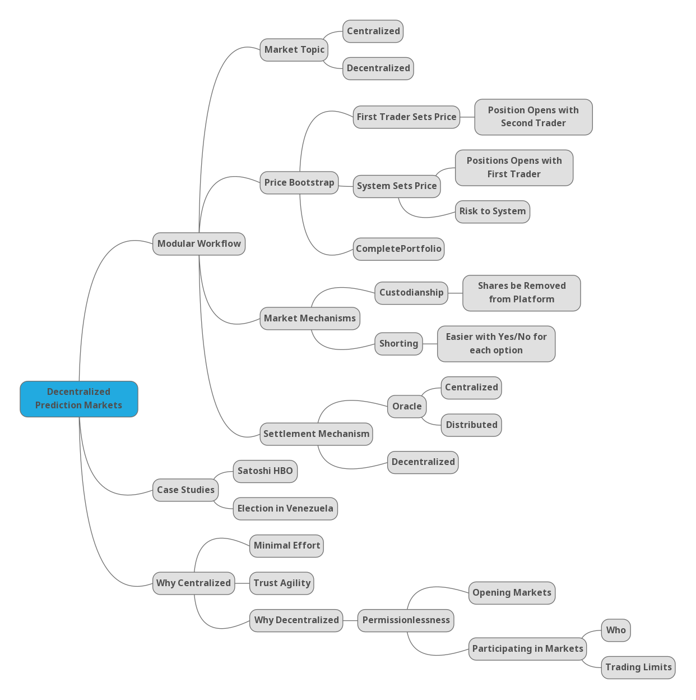

# SoK: Decentralized Prediction Markets

Open to collaboration

## Why Decentralized?

* Most prediction markets are hybrid between decentralized/centralized
* Natural question, if some aspect (e.g., closing the market) is centralized, why not just centrlaize the whole thing?
  * Permissionless participation: decentralized trading largely sidesteps regulation (accreditation, limits) and bans
  * Low barrier to entry: If a widely trusted entity (e.g., Associate Press) is willing to close a market, it is way easier to send a single transaction (Alice wins the election) than run a complete system
  * Agility: by reducing the surface area of any centralization, it is easier to swap it out or give traders multiple options to choose from

## Modular Workflow

This section will explain various design decisions that a decentralization prediction market needs to make, at various stages in the design.

#### Market Topics

* Permissionless
  * In a decentralized market, the ability for anyone to permissionlessly open a market on anything is one feature that decentralization itself could bring
  * Let a "let the market figure it out" approach could work
  * Regulatory issues or bad optics could result, but it is hard to shut down (could it be blocked for US residents through regulation c.f., TornadoCash?)
* Permissioned
  * Centralized party sets the topic and articulates a policy for resolving the market

### Bootstraping a Price

* Impossible to go from 0 traders to 1 trader
  * If 1 trader wins \$X, then someone has to lose \$X
  * Therefore you must go from 0 traders to 2 traders
* Consider: Alice, Bob, Carol, Other in some market that pays \$1
  * Safe (no risk to platform) to give set {Alice,Bob,Carol,Other} for \$1 (splitting)
  * Safe (no risk to platform) to give \$1 for set (merging)
  * Trader 1 can set limit offers and sell to Trader 2
    * Trader 2 could be there first with limit bids
  * Trader 1 can provide liquidity to an AMM, which effectively sets a price (requires twice the capital, as you need to provide ETH and shares)
    * LMSR is effectively the same, just different rule
*  Arbitrage
  * Go through invariants relating to prices adding up to \$1
    * Need to differentiate best bid and best ask in order to do this
    * Show arbitrage paths to correcting mispriced assets
    * Show also that prices can add up to more/less than \$1 if you simplify a price to a single number

### Market Mechanics

* Trading
  * Market makers (AMMs)
    * Trace history of AMMs from LMSRs as implemented by Gnosis prediction markets
    * Challenge: when one token goes to zero (after market resolves), AMMs can behave whacky
  * Classic orderbooks (LOBs)
    * need to be off-chain because too slow for L1 Ethereum
    * Maybe possible through fancy zk-rollup on L2
  * Classic call markets (frequent batch auctions)
    * same as LOBs
* Shares
  * Binary market
    * Yes/no
  * Multiple choice
    * Shares for each choice
    * Shares for Yes/No for each choice
      * Used by Polymarket
      * More complex
      * Shorting is easier (buy one share rather than incomplete set of shares)
      * Gives 2 hedging strategies: say you hold Yes for Alice. You can buy Yes for all other candidates. Or you can buy No for Alice.
      * Investigate: can volume be different for each candidate?
* Custodianship of shares
  * On-chain tokens can be taken to any other DeFi service (trading, lending, etc) or centralized third party
  * Off-chain custodianship 
    * What is left to be decentralized at this point?

## Closing the Market

* Single entity

  * Oracle
  * Example: associate press / reuters

* Small set of entities with dispute resolution

  * Distributed oracle
  * Tie into our oracle SoK: https://www.pulpspy.com/papers/2021_aft.pdf

* Self-settling markets

  * Lots of proposals: Truthcoin and onward
  * None shown to work and most seem to not work
  * Cannot measure off-chain side-bets on the market: https://bford.info/2019/09/23/rational/

  

## Case Study 1: Satoshi

* "Fun" example to demonstrate prediction market's need to filter fake information from real information

* Covers market for who would be named by the HBO documentary Money Electric as being Satoshi Nakamoto

* Early leader was Sassaman

  * Fake email tjones@hbo.com / no correlation with Long Sassaman price
  * Hack of znmebolix X account / no correlation with Long Sassaman price
  * Patterson confirms to DLNews she was not approached for documentary / check correlation with Short Sassaman price (I think there is)

* CNN publishes interview with director Cullen Hoback and reports Hoback confronts his candidate "face-to-face"

  * Tragically, Finney, Sassaman, and Friedman are deceased / strong correlation with short these
  * Not to zero, perhaps uncertainity about validity of info (voiceover not quote from director) or some weird interpretation of face-to-face

* Adam Back surges

  * Featured prominently in trailer however so was Watkins in the Q: Into the Storm (Hoback's previous series where he deanonymizes Watkins as Q)

* More noise / cheap talk

  * Fake credits so Kleiman as Satoshi memorial
  * Mow (from trailer) confirms Szabo refused to talk to Hoback (no face-to-face confrontation)
  * Random commenters who "screen tested" it or who have "sisters who work at HBO" -> cheap talk with no market movement

* Todd rising

  * Leak of Peter Todd confrontation from film

    * Leak subject to takedown notice
    * "Other" (Todd is not in market) long rallies but not to near-certainity
      * Filmmaker is confronting a bunch of people and this is not the finale?

  * 1 hour before documentary airs, Fortune magazine posts article

    * "HBO doc reveals Bitcoin creator is Peter Todd—that’s wrong but
      ‘Money Electric’ is still a good watch"

    * Market resolves to 95%+ for "Other"

      

## Case Study 2: Venezuela 

* I need to dig deeper into this but a weird case involving Polymarket, UMA's dispute resolution system (activist?), "wag the dog" reaction to prediction market closing to the "wrong" candidate, and great NGO work in collecting (and strategically releasing) polling place receipts.
* Shows that decentralized prediction markets matter in real life and are not just fun and game for bettors.

## Case Study 3: US Election

* Wait and see if there proves to be anything interesting here.